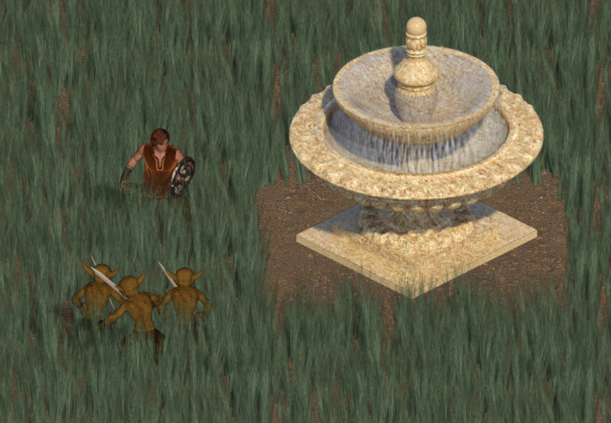
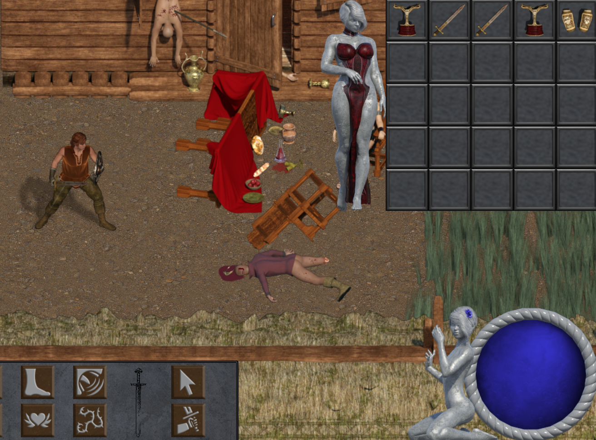
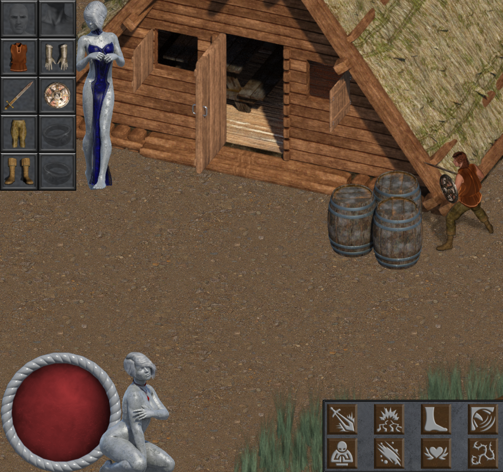
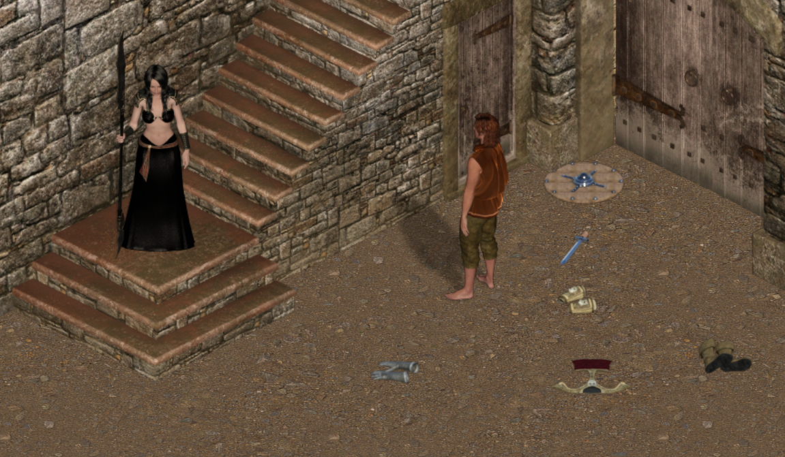

DaggerQuest in Construct 3 is no longer in development due to engine limitations.

### *The first 2D ARPG in over 20 years...*

>“So cringe it's based. This game fears no reviewer, heeds no playerbase and caters no audience.”
>
>[*Amateur Game Development General*](https://boards.4channel.org/vg/catalog#s=agdg)

>“Like if C.S. Lewis made *The Chronicles of Narnia* sexy and violent. An old school ARPG with a focus on replayability.”
>
>[*Something Awful Forums*](https://forums.somethingawful.com/)

